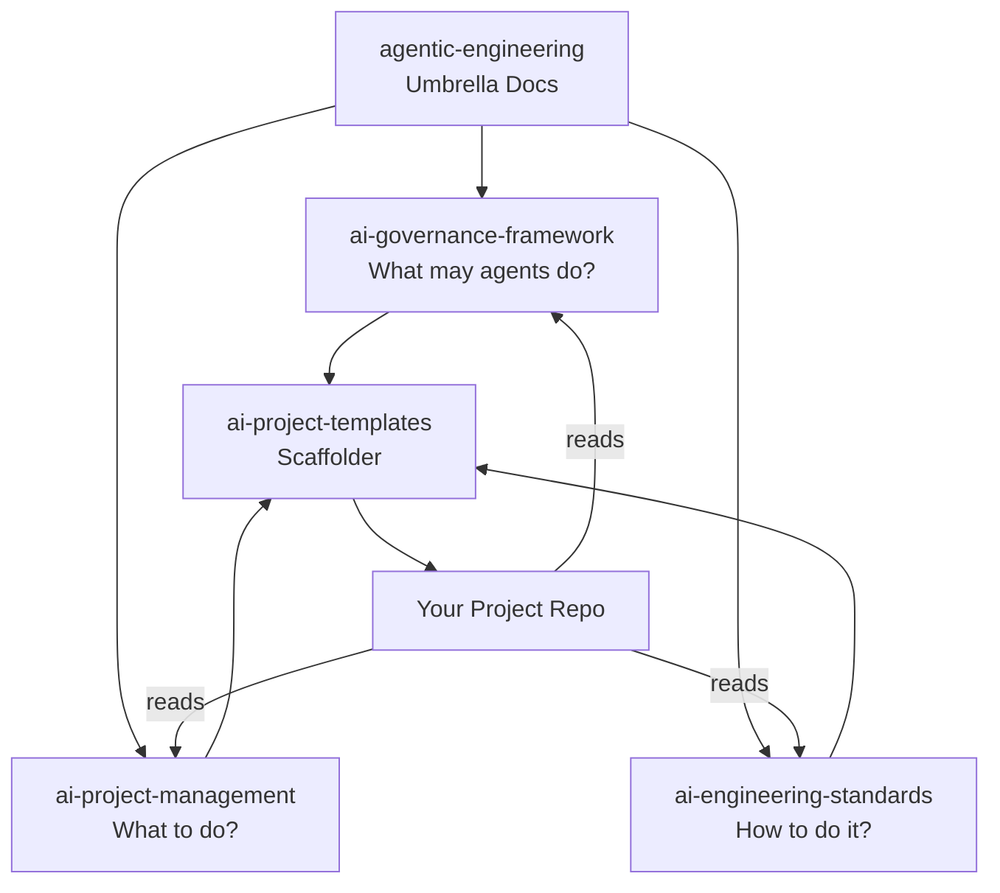
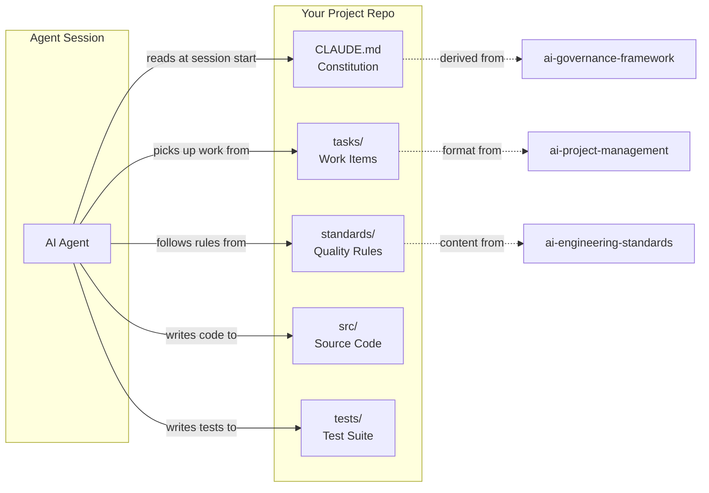
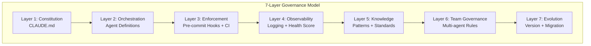

# Architecture Diagram

Visual representation of how the five repositories in the agentic engineering ecosystem connect.

## Ecosystem Flow

## Project Repo Internal Structure

## Governance Layer Detail

