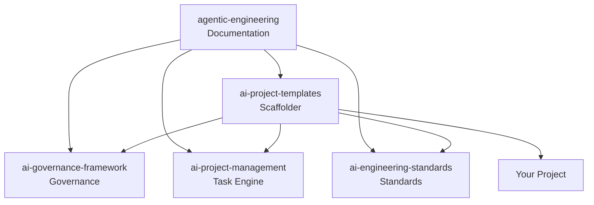

# Repo Map

The Agentic Engineering OS is composed of five repositories, each with a single responsibility. Together they form a complete operating system for AI-assisted software development.

---

## Overview

| Repo | Role | Version | Link |
|---|---|---|---|
| agentic-engineering | Learn about it | v1.0.0 | [GitHub](https://github.com/EduardPetraeus/agentic-engineering) |
| ai-governance-framework | What may agents do? | v0.3.0 | [GitHub](https://github.com/EduardPetraeus/ai-governance-framework) |
| ai-project-management | What to do? | v1.0.0 | [GitHub](https://github.com/EduardPetraeus/ai-project-management) |
| ai-engineering-standards | How to do it? | v1.0.0 | [GitHub](https://github.com/EduardPetraeus/ai-engineering-standards) |
| ai-project-templates | Scaffold it | v1.0.0 | [GitHub](https://github.com/EduardPetraeus/ai-project-templates) |

---

## agentic-engineering

**Role:** Umbrella documentation — philosophy, architecture, getting started, tutorials.

**Key files:**

| File | Purpose |
|---|---|
| `docs/tutorial.md` | Progressive tutorial (quickstart to advanced) |
| `docs/philosophy.md` | Design principles and rationale |
| `docs/architecture.md` | How the five repos connect |
| `docs/governance-in-action.md` | Concrete governance scenarios |
| `mkdocs.yml` | MkDocs Material site configuration |

**How to use:** Clone the repo and read the documentation. This repo contains no executable code — it is purely documentation and architecture maps.

**Current state:** v1.0.0. Full documentation site with MkDocs Material, guides on multi-agent patterns and context architecture, reference glossary, and end-to-end tutorials.

---

## ai-governance-framework

**Role:** Constitutional governance for AI agents. Defines what agents are allowed to do, what they must never do, and how compliance is enforced.

**Key files:**

| File | Purpose |
|---|---|
| `templates/CLAUDE.md` | Governance constitution template |
| `automation/drift_detector.py` | Compares project CLAUDE.md against template |
| `automation/content_quality_checker.py` | Validates governance file quality |
| `templates/ci-cd/github-actions-governance-gate.yml` | CI workflow for governance checks |
| `patterns/` | 19 governance patterns (blast-radius, confidence-ceiling, etc.) |

**How to use:** Copy the CLAUDE.md template into your project and customize it. Use the automation scripts for governance validation. Add the CI workflow for automated enforcement on every PR.

**Current state:** v0.3.0. The most mature repo in the ecosystem. 864 tests, 94% coverage. 7-layer governance model, compliance mappings for SOC 2 and ISO 42001.

---

## ai-project-management

**Role:** YAML-based task engine for AI agent workflows. Defines what the agent should build, in what order, and with what acceptance criteria.

**Key files:**

| File | Purpose |
|---|---|
| `templates/task-template.yaml` | Task YAML template |
| `templates/commands/pick-next-task.md` | Agent command: select next task from backlog |
| `templates/commands/complete-task.md` | Agent command: mark task as done |
| `templates/commands/create-task.md` | Agent command: create new task |
| `schema/task-schema.yaml` | Task YAML schema definition |

**How to use:** Create task YAML files in your project's `backlog/` directory. Each task is one file with id, title, description, priority, acceptance criteria, and status. The agent reads these to determine what to build next.

**Current state:** v1.0.0. Task schema, lifecycle workflow (backlog/active/done), and agent commands for task operations.

---

## ai-engineering-standards

**Role:** Code conventions, testing requirements, git workflow, and quality standards. Defines how the agent should write code.

**Key files:**

| File | Purpose |
|---|---|
| `templates/ruff.toml` | Ruff linter configuration |
| `templates/pyproject.toml` | Python project tooling config |
| `docs/conventions.md` | Naming, structure, style conventions |
| `docs/testing.md` | Testing requirements and coverage thresholds |
| `docs/git-workflow.md` | Branching strategy, commit conventions, PR process |

**How to use:** The scaffolder copies the relevant config files into your project's `.engineering/` directory. The agent reads these configs and follows the conventions. CI enforces them with `ruff check` and `ruff format --check`.

**Current state:** v1.0.0. Ruff-based linting, Python conventions, git workflow standards, and review checklists.

---

## ai-project-templates

**Role:** Project scaffolder that instantiates governance, project management, and engineering standards into a new repository with a single command.

**Key files:**

| File | Purpose |
|---|---|
| `scaffold.py` | Main scaffolder CLI |
| `stacks/python-data/` | Template for data engineering projects |
| `stacks/python-web/` | Template for web application projects |
| `stacks/docs-only/` | Template for documentation-only repos |

**How to use:**

```bash
cd ai-project-templates
python scaffold.py --name my-project --stack python-data --mode solo --output-dir ../
```

**Arguments:**

| Argument | Required | Options |
|---|---|---|
| `--name` | Yes | Project name (directory name) |
| `--stack` | Yes | `python-data`, `python-web`, `docs-only` |
| `--mode` | Yes | `solo`, `team` |
| `--output-dir` | No | Parent directory (default: current) |

**Current state:** v1.0.0. Three stack templates, solo/team modes, generates complete project structure with CLAUDE.md, AGENTS.md symlink, backlog, agent commands, engineering config, CI workflow, and ADR template.

---

## Dependency Graph



`agentic-engineering` references all four repos in documentation. `ai-project-templates` depends on the other three for template content. Your project is self-contained after scaffolding — no runtime dependency on any framework repo.

---

## See Also

- [Architecture](../architecture.md) — Detailed architecture diagram and integration points
- [Tutorial](../tutorial.md) — Setup guide using the scaffolder
- [Glossary](./glossary.md) — Key terms defined
